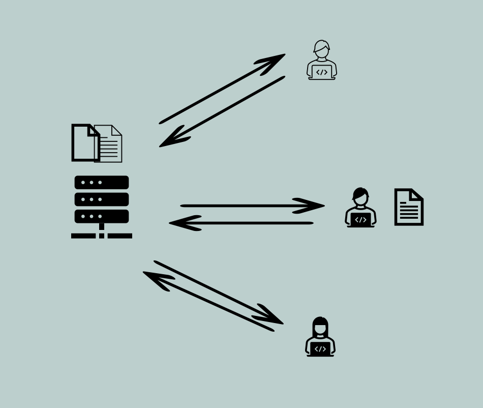

## Version control systems (VCS) Introduction ##

## What is a Version Control System?
- The Version control systems (VCS) are software tools that help manage changes to a set of files or a collection of code, enabling multiple people to collaborate on a project.
- The primary purpose of a version control system is to keep a historical record of changes made to a project's files or source code.
- They take snapshots of your work across time, creating checkpoints, track the history of modifications made to files, allowing users to easily revert to previous versions, compare changes, and merge modifications from different sources.

> Please remember version control doesn't replace the need for a backup of your project. In the event of disk failures, it is always a better idea to have a backup of your project.

## Why do we need a Version Control System?
- Just as we store digital pictures, emails, and resumes in file format, we also store software components such as code files for Java, C, C++, and Python, infrastructure elements like ARM templates, Terraform, and Cloudformation, and configuration files in formats like XML and YAML. To manage changes to these files, a system is necessary.

## What are the different version control systems?
- There are two types of version control systems.
  - Centralized
  - Distributed

- **Centralized Version Control Systems (CVCS)**: a central server that stores the entire codebase and version history. Developers check out files from the central repository, make changes locally, and then commit the changes back to the server.
- e.g: Concurrent Versions System (CVS), Apache Subversion (SVN).

- **Distributed Version Control Systems (DVCS)**: each developer has a complete copy of the codebase, including its full history, on their local machine. This allows for more decentralized and independent development. Developers can commit changes locally and synchronize them with other repositories when needed.
- e.g: Git, Mercurial.
