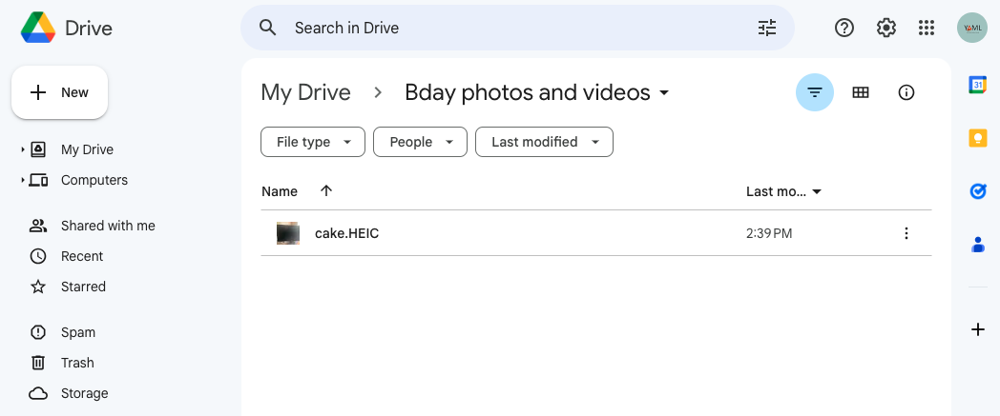
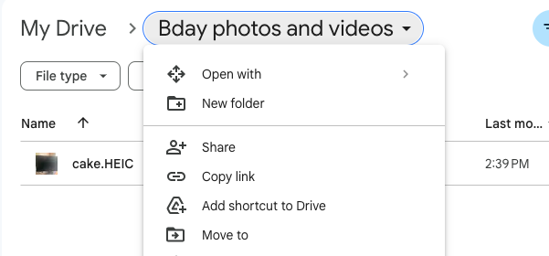
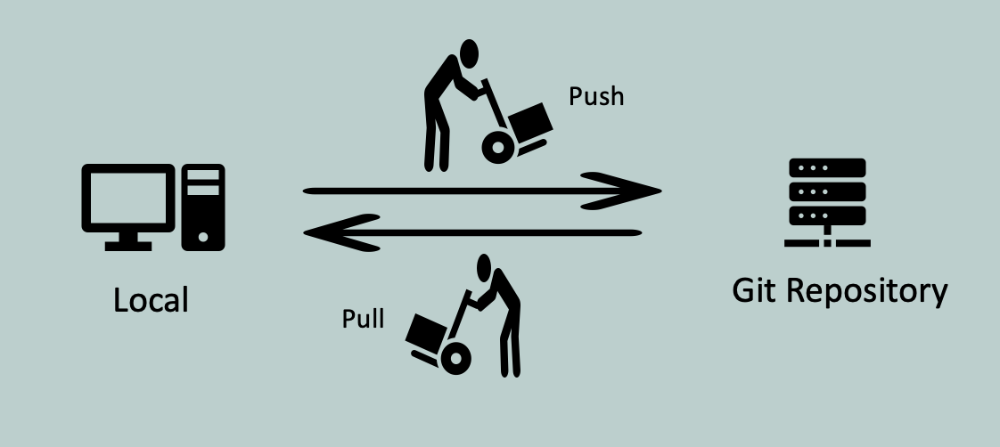

## Git Introduction ##

## What is Git? 
- As metnioned previously, [Git](https://en.wikipedia.org/wiki/Git) is a Distributed Version Control System tool. [Linus Torvalds](https://en.wikipedia.org/wiki/Linus_Torvalds) (who is also known for the Linux kernel) initially authored Git.
- Git keeps track of the changes they make to code.
- Git is like a time machine for programming.
- Git’s Distributed nature makes it easy for developers to work on different features or bug fixes concurrently without directly affecting each other's work. They can share their changes with others and even combine them into one code.
- It become the most widely used version control system due to its distributed nature, speed, and powerful features.
> Linus Torvalds shared his thoughts on git in a [google tech talk](https://www.youtube.com/watch?v=4XpnKHJAok8). It's not a tutorial and aimed for users who have some knowledge of version control systems.

## What is GitHub?
- [Github](https://github.com/) is a internet based code hosting platform for version control and collaboration.

> Git and GitHub are different things. GitHub is a website that helps you manage Git controlled projects. Github provides services that are related to Git.
 
## Layman's terms example
> [Google drive](https://drive.google.com/drive) is an online file storage/sharing platform.
- Imagine you want to share your birthday pictures and videos to a video editor. You can use Google Drive to store and share.
- Take some good Bday Pictures
- create a Google Drive Folder

- upload your image or video files to Google Drive Folder
- create a sharable link

- provide access(operations) permissions

> [Github](https://github.com/) is a internet based code hosting platform for version control and collaboration.
- Similar way, you create a project and initialize version control system(here it's git)
- create a GitHub repo (repo is a placeholder/folder)
- upload your project files to GitHub repo
- create a Github(sharable) link
- provide access(operations) permission to edit the files or upload new files

> Several popular code hosting platforms like GitHub exist, such as Bitbucket, and GitLab.
> GitHub and Bitbucket are cloud-based solutions, GitLab enables you to set up the same functionality on your own servers.

## Git terminology
#### Repository ####
- It's like a folder containing a project's files and metadata like the file's version history
#### Local ####
- Repository stored in your computer or any computer
#### Remote ####
- Repository stored in an internet server like GitHub, GitLab, or BitBucket
#### Commit ####
- A point for file changes, like a milestone marker on the road
#### Push and Pull ####
- Push is an operation to move the commit changes from the local to the remote repository
- Pull is an operation to update commit changes from the remote to the local repository
