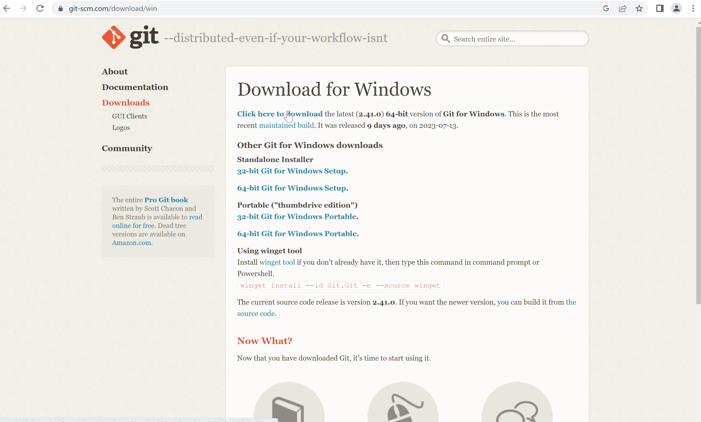

## Environment Setup ##

### Git Installation Setup ###
> Git's officeal [website](https://git-scm.com/downloads) provides detailed instructions.
- Git installation
    - [Windows](#windows)
    - [Mac OS](#mac-os)
    - [Linux OS](#linux-os)
- Create GitHub account
- Git Configuration file
- ssh configuration for authentication and authorization
- (Optional) Sourcetree tool installation

## Windows
> You'll need administrative privileges for installation.
- Go to [Git scm](https://git-scm.com/downloads/win). Click on Windows button under Downloads

- Download Standalone Git scm installer for your version 32 bit or 64 bit depending on your System. You can find the your system details in system properties in Control panel.
- After download is complete, run the installer and follow on screen instructions.

- Select destination location to install git and keep all settings as default.
- Check if git status your system by using git command on command prompt.
 
`> git`

## Mac OS
- Check if git is already available in your system by using git command on terminal.
 
`$ git`

- Run following command to install git using homebrew package manager tool.
 
`$ brew install git`

## Linux OS
- Please follow the [link](https://git-scm.com/download/linux) for installtion of git in Linux OS
- Steps:
    - If you’re on RPM-based linux distribution, use dnf:
   
    `$ sudo dnf install git-all`
    - If you’re on a Debian-based linux distribution, use apt:
   
    `$ sudo apt install git-all`
## Create GitHub account
- Go to [github](https://github.com/) and signup for your account.
- After signup, click signin or use [github login](https://github.com/login) link.

## Git Configuration file
- What is Git Configuration file?
    - The git config file is collection of settings and options for a specific Git repository or globally across all Git repositories on your computer.
    - The configuration settings and options are stored in .gitconfig text files.
- you can find username and email for your github account from profile settings

- To configure git user name globally in your computer, type following command on your terminal/command prompt
 
`git config --globally user.name "Your Name"`
- To configure git user email globally in your computer, type following command on your terminal/command prompt
 
`git config --globally user.email "your.email@example.com"`

> if you want to check all the configuration settings for your repository, you can run `git config --lits`. The configuration settings are save as `.gitconfig` file under home directory(`~` in Linux and MacOS and `c:\users\<username>\` in Windows)

## ssh configuration for authentication and authorization
> In August 2021, GitHub removed support for password authentication for HTTPS URLs. You should use ssh key to push your code from local(your computer) to remote(github).
> Based on your OS type, follow corresponding "Create SSH key pair" operation

## Create SSH key pair (Linux)
- Open terminal and go to ssh folder
 
`$ cd ~/.ssh`
- Use the ssh-keygen command to create GitHub SSH key pairs(public and private keys)
 
`$ssh-keygen -o -t rsa -C "youremail@domain.com"`
> -o flag to generate with the OpenSSH format, -t flag specifies the type of SSH key(e.g: rsa), -C add comment as metadata at the end of the public key
- you to choose a location in which to save the public and private keys. Just click return/enter to leave them in the .ssh folder.
- It will also ask you to protect your GitHub SSH key with an optional passphrase. Leave the passphrase blank, so click return/enter when prompted.
- After completion of command execution, it generates one public key (id_rsa.pub) and one private key(id_rsa).
- You will need to paste the contents of your public SSH key into GitHub. 
- Cat the file (id_rsa.pub) and copy to the clipboard.

## Create SSH key pair (Windows)
- Open powershell
- Use the ssh-keygen command to create GitHub SSH key pairs(public and private keys)
 
`>ssh-keygen -o -t rsa -C "youremail@domain.com"`
> -o flag to generate with the OpenSSH format, -t flag specifies the type of SSH key(e.g: rsa), -C add comment as metadata at the end of the public key
- you to choose a location in which to save the public and private keys. Just click return/enter to leave them in the .ssh folder.

- It will also ask you to protect your GitHub SSH key with an optional passphrase. Leave the passphrase blank, so click return/enter when prompted.
- After completion of command execution, it generates one public key (id_rsa.pub) and one private key(id_rsa).
- You will need to paste the contents of your public SSH key into GitHub. 
- go to .ssh folder under user profile and select the file (id_rsa.pub) and copy to the clipboard.

## Register the public SSH key with your GitHub acount
- Log into GitHub. navigate to your account settings, and Click on this link named “SSH and GPG keys”, and Click "New SSH Key". 
- Provide a unique name, and paste the value of the private GitHub SSH key you copied earlier.

- That's all, You have successfully configure the required secure communication process steps.

## (Optional) Sourcetree tool installation
- Sourcetree is a free GUI client for Git.
- Go to [sourcetree](https://www.sourcetreeapp.com/) and click Download button.
- Double click to install the application
- It prompt Registration, you can skip.
- At install tools step, uncheck Mercurial.
- At Preferences screen, provide your git username and email address details.
- After installation is complete, It open local repositories tab.

    