## Git Project Flow ##
- Creating Git and GitHub repository - end to end example
    - local repository
    - remote repository
    - Push the local changes to remote using Git command line interface
    - (Optional) Push the local changes to remote using sourcetree tool (GUI)
- File states
    - Untracked
    - Tracked/Modified
    - Staged
    - Committed
- Git workflow commands
    - git init
    - git status
    - git add
    - git commit
    - git push
- Git ignore file
- Assignment

## Creating Git and GitHub repository - end to end example
- Assume you want to start a startup. You want to track your programming project file changes using ***Git*** on local computer, and your future goal is to hire more developers and collaborate on the project with them using ***GitHub***.
- You will learn the first phase steps and concepts in this chapter; and How multiple developers can work simultaneously on a project in the next chapter.

## local repository
> Git doesn't track all of the files stored on your computer. You need to instruct Git to track certain files and directories. This process is called **initialization**. This section covers tracking your programming project file changes using ***Git*** on a local computer.
- Create a director with name **firstproject**
- Navigate to **firstproject** director and create a sample **README.txt** file.
> If you are familiar with any programming language, please create a programming file like HelloWorld.java or HelloWorld.py, or HelloWorld.c file.
- type any sample test in the file.
- Open terminal(command tool in Windows) and navigate to the **firstproject** director using `cd` command
- type `git init`
> git init creates `.git` folder in your repository. All information related to file changes are stored in this `.git` folder. Neve edit any files in the `.git` directory.
- git maintains 4 stages of File changes
    - Untracked: When you create a new file to your project directory, Git considers it untracked until you explicitly tell Git to start tracking it by using init command.
    - Tracked: After you make changes to a tracked file, Git recognizes that the file has been modified since the last commit. These changes are not yet committed.
    - Staged: After you make changes to a tracked file, can move the file changes to interim state before commit. Git recognizes that the file has been modified and ready for the next commit.
    - Committed: Once you run git commit, the changes to the tracked files in the staging area are permanently saved in the Git repository as a new commit. A commit is like a snapshot of the current state of your code. You can go back to a certain commit at a later time. Each commit contains a hash that uniquely identified the commit.
> let's see all stages for the **README.txt** file.
- type `git status` and press enter. Git status command provide the all file status. It shows the README.txt file is a Untracked file.
> git status command shows the status of your repository. It provides a lot of information, such as which files are untracked or tracked, which is the current branch, the status of the current branch, and the current branch's status with respect to a remote branch.
- type `git add README.txt` and press enter. Git add command move the file from Untracked to Tracked.
> You can simplify the above command as `git add .`, tells git to add any files or subdirectories within the current directory. Please aware of that `git add .` can add unnecessary files to the repository.
- type `git status` and press enter. This time git status shows **README.txt** file changes to be committed.
- type `git commit -m "Initial commit"` and press enter. The changes to the tracked files in the staging area are permanently saved in the Git repository as a new commit.
> -m option to provide the commit message.
<br>

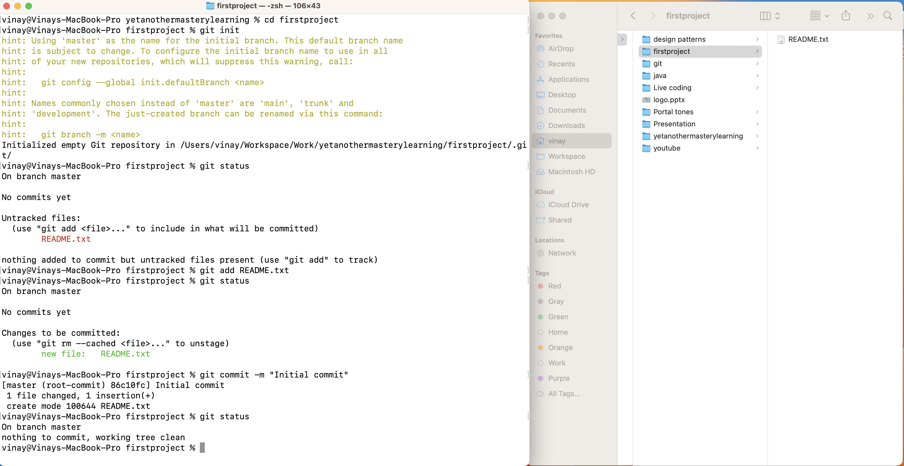
> The string value 86c10fc shown in the above pic. It's the hash value of the commit.
## remote repository
- Since Git is a distributed version control system, it's possible to have multiple copies of the same repository. To avoid confusion and ensure that all team members are working with the latest version of the code, it's common practice to store a copy of the repository in a centralized location, such as a server or the cloud.
> Creating ***GitHub*** account
- Go to [github](https://github.com/) and signup for your account. [Ref: GitHub account creation steps](../03.%20Environment%20Setup/#create-gitHub-account).
- Login to [github](https://github.com/). It will open a dashboard page
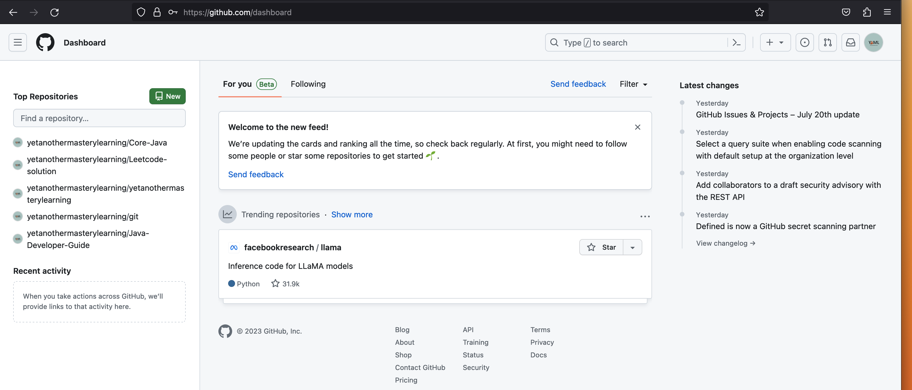
- Click new button to creat a repository. Give repository name same as your local project(e.g: firstproject) and keep other options as default
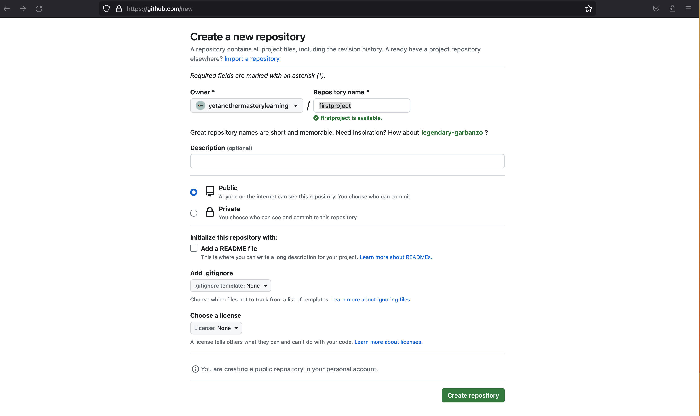
- Copy the reposiotry ssh link
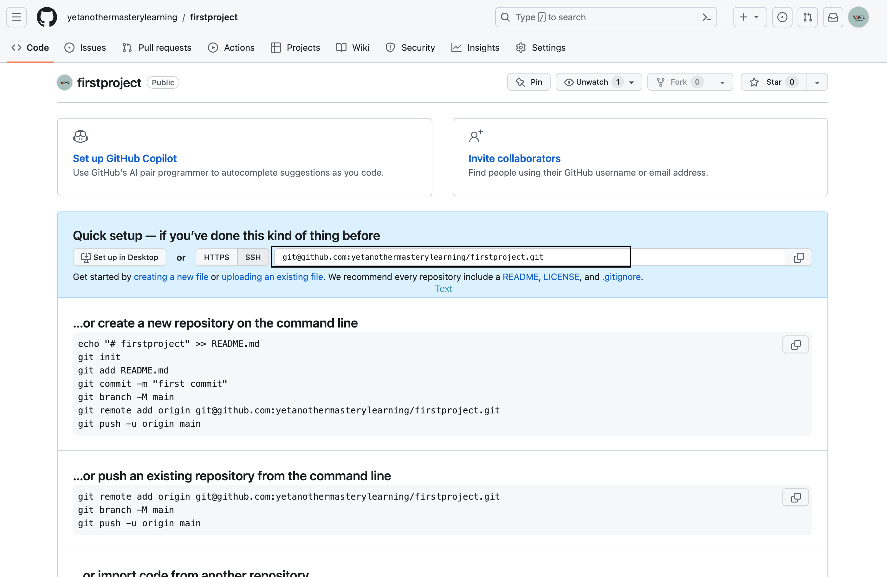<br/>

## Push the local changes to remote using Git command line interface
> Push your project changes to ***GitHub*** and collaborate it with others. Please make sure you completed the git config file setup [Ref: Git Configuration file](../03.%20Environment%20Setup/#git-configuration-file)
- Go to terminal(command tool in Windows) and Navigate to the **firstproject** director using `cd` command
- type `git remote add origin <url>` and press enter.
  - `git remote add origin git@github.com:yetanothermasterylearning/firstproject.git`
> remote is a reference to external copy.
- type `git push -u origin master` and press enter.
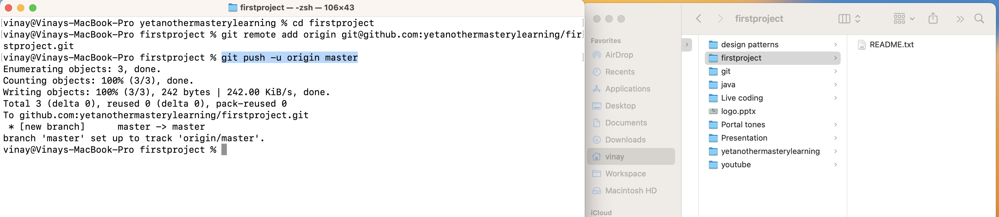
- Refresh the Github project page.
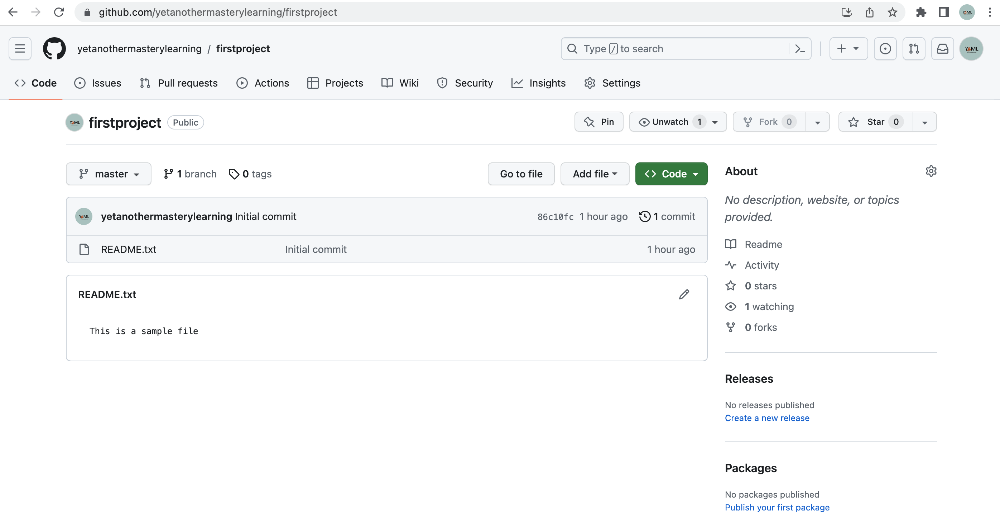

## Push the local changes to remote using Sourcetree tool
> Push your project changes to ***GitHub*** and collaborate it with others
- Open Sourcetree tool and click New -> Add Existing Local Repository
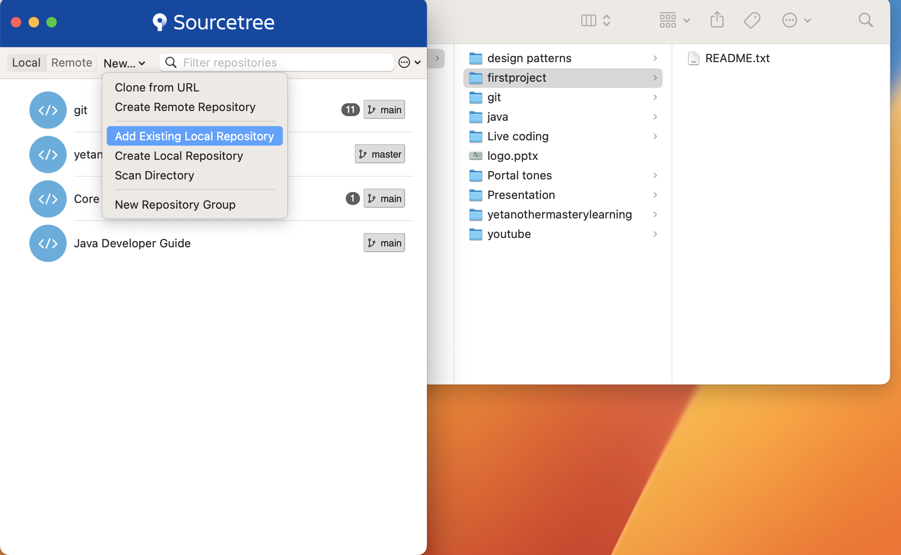
- Select **firstproject** director, it add **firstproject** repository to home screen
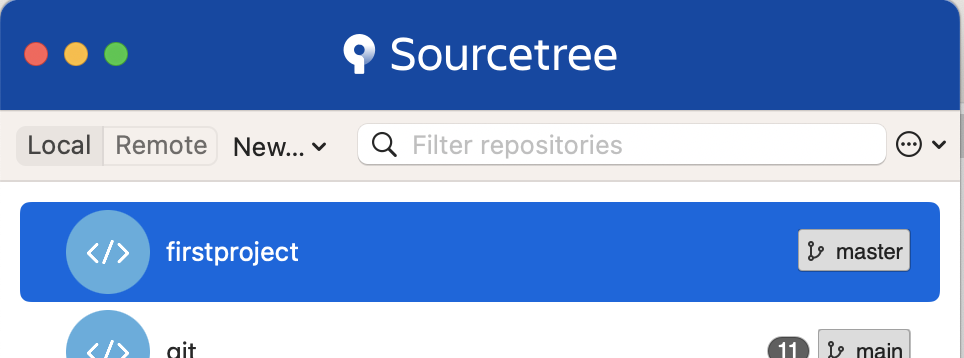
- double click the **firstproject** repository on home screen, it will open the GUI for the repository changes.
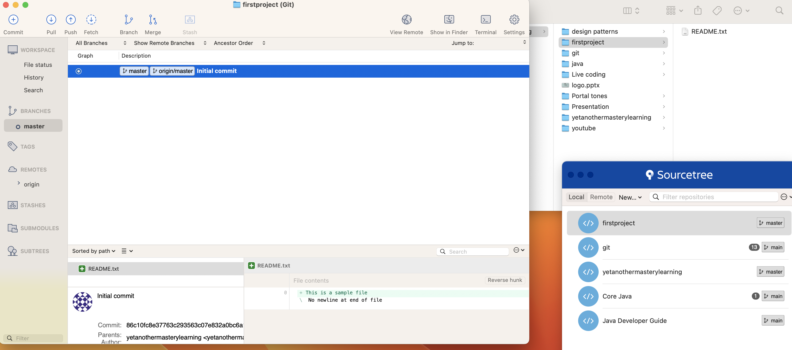
- Open "README.txt" and add some test in the file.
- after saving file, sourcetree file changes screen(rightside widget) display all uncommented/modified changes.
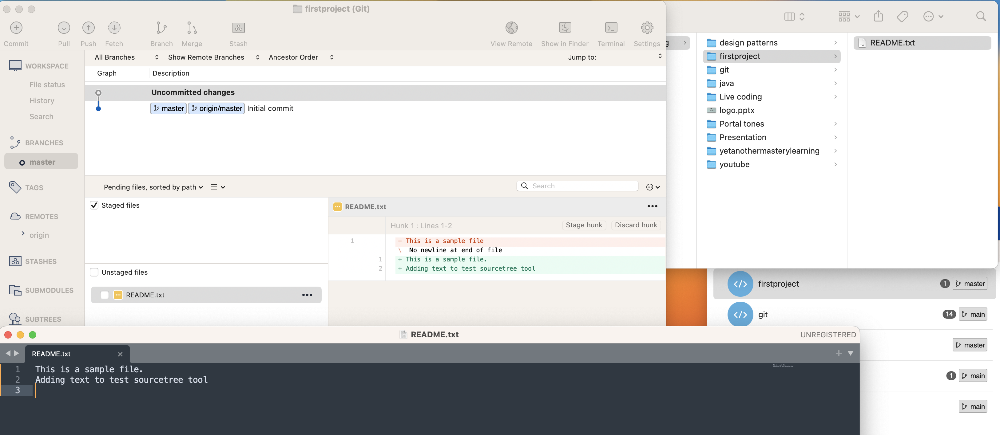
- Like git command interface way, we need to apply add and commit commands from sourcetree.
- On sourcetree, click file changes and split the view between staged and unstaged files
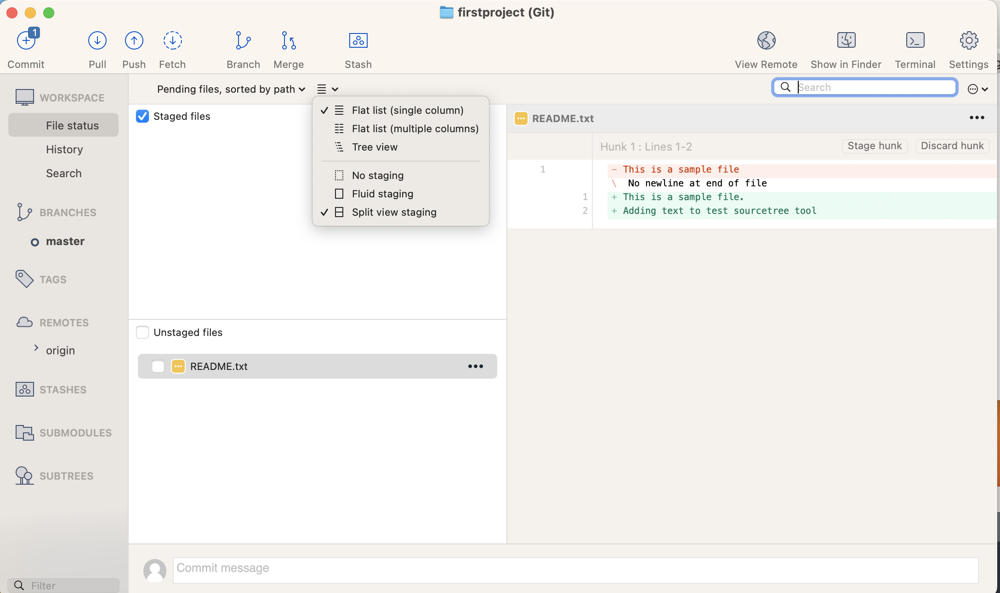
- Select unstaged **README.txt** file. It will move the recent changes to staged area. It's nothing but `git add` command.
- Add commit message and click commit button.
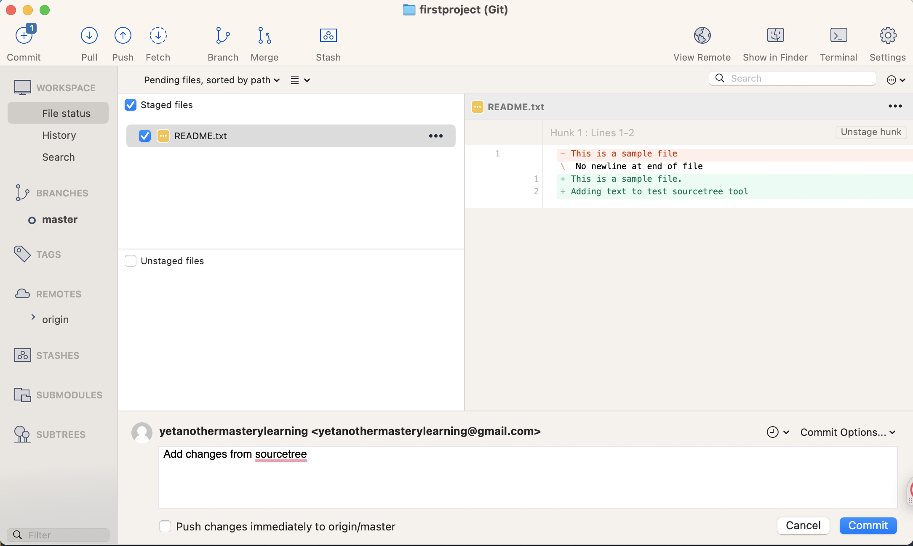
- After successful commit operation, the push button higheligh with number of commits(Here it's one) which are ready to push to master.
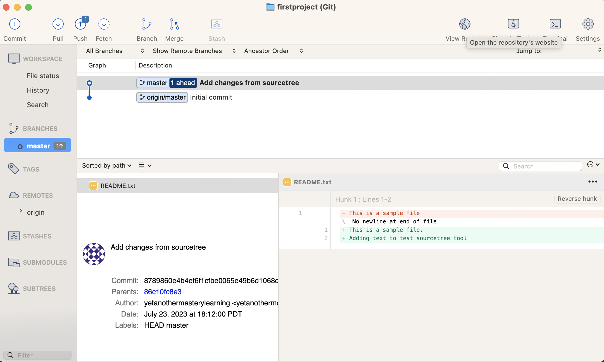
- Click repository setting to configure remote. We have already configured the remote in the previous section. It's nothing but `git remote add origin <url>` command.
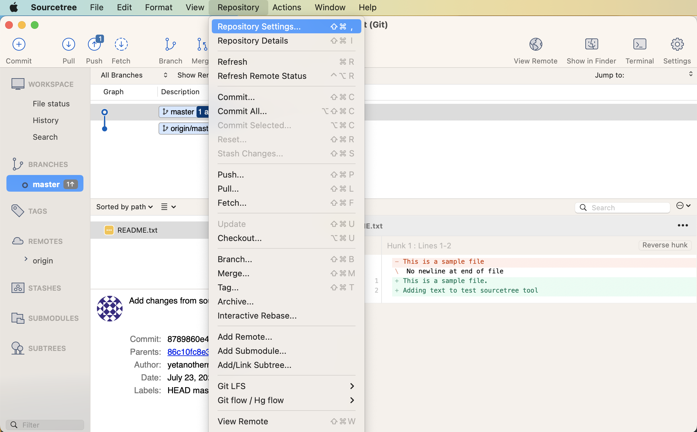
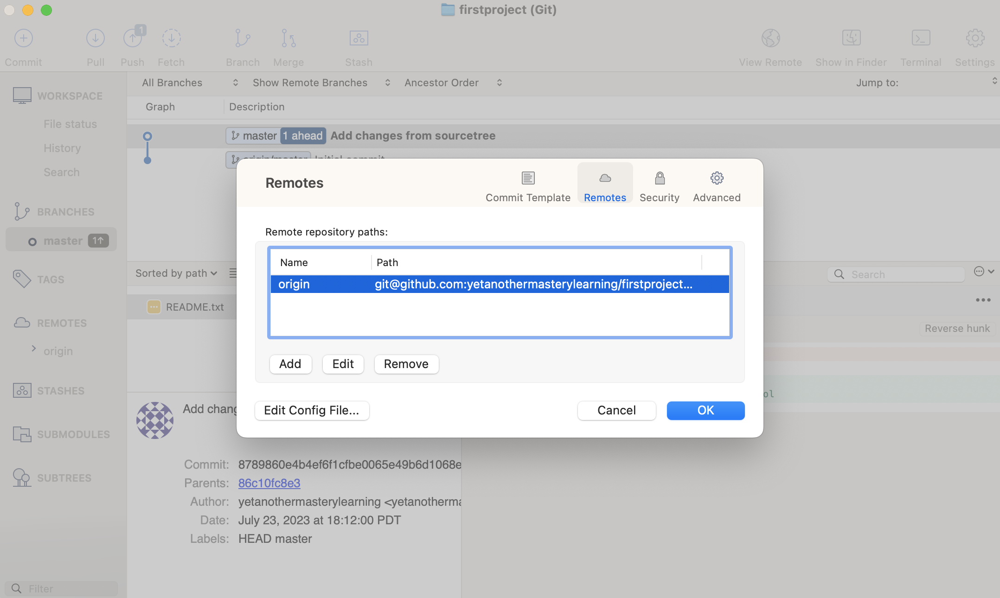
- Go to sourcetree screen and click push button. Open a remote branch details and click push button
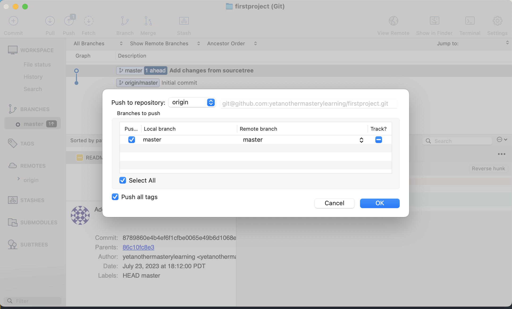
- Refresh the Github project page.
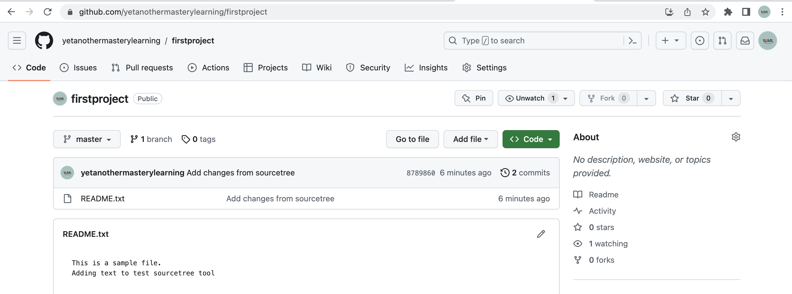

***
> You can invite others to collabrate this project by addeding collaborators in this repository setting.
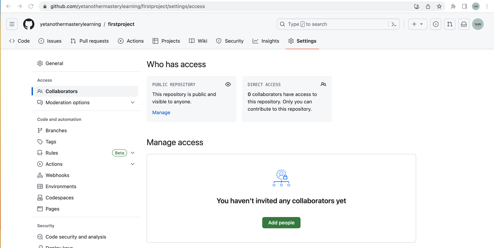<br/>
***

## File states
- git maintains 4 stages of File changes
    - Untracked: When you create a new file to your project directory, Git considers it untracked until you explicitly tell Git to start tracking it by using init command.
    - Tracked: After you make changes to a tracked file, Git recognizes that the file has been modified since the last commit. These changes are not yet committed.
    - Staged: After you make changes to a tracked file, can move the file changes to interim state before commit. Git recognizes that the file has been modified and ready for the next commit.
    - Committed: Once you run git commit, the changes to the tracked files in the staging area are permanently saved in the Git repository as a new commit. A commit is like a snapshot of the current state of your code. You can go back to a certain commit at a later time. Each commit contains a hash that uniquely identified the commit.

## Git workflow commands
- git init:
    - initialize a new Git repository in using the git init command.
- git status:
    -  It is helpful for quickly understanding the changes and the branch you are currently on.
- git add
    - To add all changes (both modified and new files) to the staging area.
    - git add <file> to add individual files or use patterns with wildcards 
        - e.g. `git add *.txt` to add all files with the .txt extension
        - e.g. `git add .` to add all files in the current directory
- git commit
    - Creates a new snapshot of the project changes at that specific point in time.
    - Each commit in Git has a unique identifier (hash) that allows you to refer to it later
        - e.g: `git commit -m "<commit change message>"`
- git push
    - Send the commits and associated changes from your local repository to a remote repository.
    - Syntax: git push -u <remote> <branch>
        - e.g: git push -u origin master


## Git ignore file
- Sometimes, tracking the history of specific files, such as log files or build artifacts or class files in a Java project or out files in C programs, may be unnecessary. It's tedious for a developer to avoid when performing the git add operation.
- An excellent way to ignore a file or folder or group of files by using the gitingore file.
- gitingore file is like a rules for excluding the files and directories from the git version control mechanism. (like some secrets skips during programmer time traveling. :stuck_out_tongue:)
- The complete file name is `.gitingore`.
- You can also use global .gitignore files that apply to all your repositories or per-repository .gitignore files for more specific exclusions.
- A basic `.gitignore` file might look like this:
```
# Ignore compiled files
*.class

# Ignore dependencies or temporaty folders
node_modules/
tmp/

# Ignore temporary (like log) files
*.tmp
*.log

# Ignore system-specific files
.DS_Store
Thumbs.db

# Ignore IDE and editor files
.vscode/
.idea/
*.sublime-project
```
Note that the rules in the .gitignore file use wildcards and patterns to match files and directories that should be ignored.
>You can bookmark the different [gitignore file templates](https://github.com/github/gitignore) and use them later based on your project/framework.

## Assignment
#### Assignment-1 ####
- Create a HelloWorld application using Java (or any programming language).
    - Create a single java file which should display "Hello World"
- Initialize git and include the program file to you repo
- Compile the code and monitor all file status by using git status command
    - It should display your java file and byte code(.class) file
- Create a .gitignore file and make sure to avoid byte code file(*.class)
- Monitor the file status by using git status command. The class files should not be tracked by git.
    - It should skip adding your class files.
- commit the changes with message "add hello world file"
- Create a GitHub repo and publish/push your local repository to remote repository

#### Assignment-2 ####
- Change the HelloWorld file text to "Hello Java"
- commit the changes with message "change hello world text to hello java"
- commit the changes with message "add hello world file"
- Push your local repository to remote repository

#### Crazy thought :wink: ####
- What happens if you add .gitignore in your .gitignore file?
