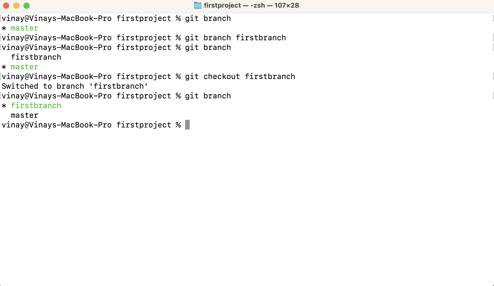
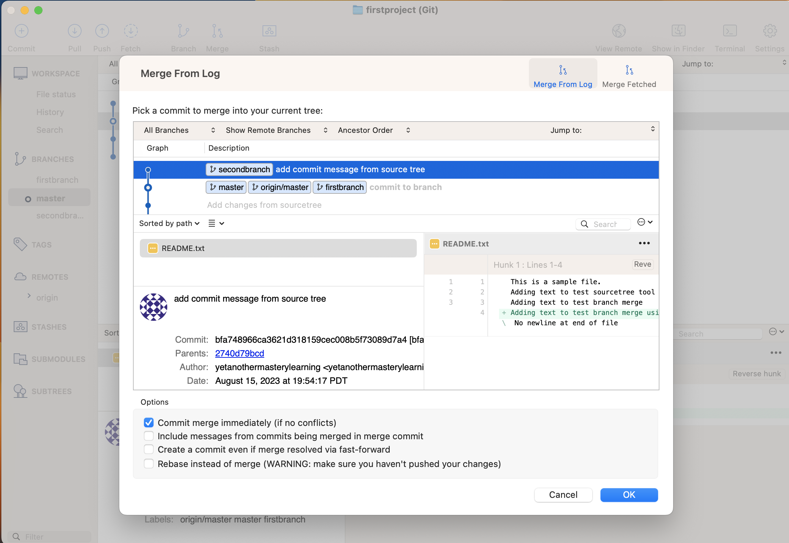

## Git Branch Concept
- What is a branch?
- Layman's terms example
- Why do we need a branch?
- Creating a branch in local
- Checkout an existing branch in local
- Creating a branch and checkout in local
- display all branches in local
- Delete a branch in local
- Merging a branch 
- Branch operations using SourceTree
- Merge Conflict
- Branch naming approach
- Branch vs HEAD
- Assignment

## What is a branch?
- Assume you want to add a new things in your startup project. What if you tried something ambitious and it broke everything that was working earlied? This problem is solved by using the branch concept in Git.
- Git Branches help us work on different parts of the project.
- In technical terms, a branch is a lightweight movable pointer pointing to a specific version history commit. When you create a new branch, it effectively creates a new line of development, allowing you to work on a particular feature or bug fix independently from the main line of development
- In Layman's terms, Imagine you and your friend share a two-bedroom apartment. Each of you has your own bedroom for sleeping or working without disturbing the other. You can watch TV together in the living space. Similarly, developers can independently create their branch and work on it. Once the work completes, they can merge all the changes into the main/master branch and provide the whole project.

## Layman's terms example
- Imagine you are conducting a birthday party for your kid at a park. 
- You plan to decorate a stage, bring a cake, and arrange excellent food. 
- You got a fantastic idea that you can share the work with friends. Assume You can work on decorating the stage and request friend "A" to collect the cake and friend "B" to collect the food. 
- Each person works independently and finishes the party. 

- Similar way, you create a project plan with the required features
- Allocate the work to developers
- Individual developers can work independently by creating an individual branch
- At the end, you can merge all changes to a master/main branch(the code)


## Why do we need a branch?
- Branches allow multiple people to work on the same project simultaneously without interfering with each other's work.
- Branches help us to work independently, quick rollback, experimentation without disturbing the original code, parallel collaboration, and versioning.

## Creating a branch in local
- Open a terminal or command prompt in the directory where your Git repository is located.
- use ```git branch <new_branchname>``` to create a branch


## Checkout an existing branch in local
- Open a terminal or command prompt in the directory where your Git repository is located.
- use ```git checkout <existing_branchname>``` to checking out an existing branch

> checkout is used for multiple purposes in Git.

## Creating a branch and checkout in local
- Open a terminal or command prompt in the directory where your Git repository is located.
- use ```git checkout -b <new_branchname>``` to checking out to a new branch

> The branches we've created are based on the latest commit of the current active(master) branch.

### Push local branch to remote
- After creating branch, Perform some file changes and commit the changes
- To push changes, type `git push -u origin <branch_name>` and press enter.

- Refresh the Github project page.


## display all branches in local
- Open a terminal or command prompt in the directory where your Git repository is located.
- use ```git branch``` to list all branches


## Rename a branch in local
- Open a terminal or command prompt in the directory where your Git repository is located.
- use ```git branch -m <new_name>``` to rename current branch


## Delete a branch in local
- Open a terminal or command prompt in the directory where your Git repository is located.
- You can't delete a checked out branch, Switch to another branch using the checkout command. 
- If the branch you want to delete has no unmerged changes (you've already merged those changes into another branch), you can use the -d option.
	- use ```git branch -d <branchname>``` to delete a branch

- If you want to delete the branch regardless of unmerged changes forcefully, you can use the -D option
	- use ```git branch -D <branchname>``` to delete a branch forcefully


## Merging a branch
- Once a branch code changes are ready to be integrated into the main codebase or any other branch. You can apply a merge operation to move code changes from your branch to main/master branch or any other branch.
- To merge ***branch_a*** with another ***branch_b***. first checkout ***branch_b*** and run merge command ***branch_a***
- Here, we merge our current branch with master branch. Switch to the target branch (branch where you want to receive the code)
```git checkout master``` 
- use the git merge command followed by the name of the target branch. by default git merge follow **fast forward** merge operaion.
```git merge <branch name>```


- After merge push the master branch to remote

## Branch operations using SourceTree
- Creating a branch and checkout in local


- display all branches in local

- Delete a branch in local

- Merging a branch 
	- Switch to the target branch (here master)
	
	- Apply merge
	
- push master branch


## Merge Conflict
- When the same file is modified in different branches, Git raises a **conflict** to avoid data loss.
> While working on real projects, first merge the master/developer branch to your branch. Resolve merge conflicts; merge your branch back to the master/developer branch. More details on merge conflict resolution will be in the upcoming chapter.

## Branch naming approach
- here are some commonly used standards and best practices for naming Git branches.
	- Main Development Branch: 
		- main, master, or develop. 

	- Feature Branches:
		- Format: feature/<feature-name>
		- Example: feature/user-details-api

	- Bug Fix Branches:
		- Format: bugfix/<bugshortdescription-name>
		- Example: bugfix/user-authentication-timeout

	- Hotfix Branches (for critical production fixes):
		- Format: hotfix/<hostfix-name>
		- Example: hotfix/rollback-vip-configuration

	- Release Branches (preparing for a new release):
		- Format: release/version-number
		- Example: release/2.0.0

	- Personal or Experimental Branches:
		- Format: <username>/<short-description>
		- Example: vinay/refactor-api

	- Integration or Staging Branches:
		- Format: integration, staging, or testing

	- Documentation Branches:
		- Format: docs/<short-description>
		- Example: docs/update-api-documentation

	- Dependency Update Branches:
		- Format: deps/library-name-version-update
		- Example: deps/react-17-update

## Branch vs HEAD
- Branch is a pathway through the commits
- HEAD of a branch points to the latest(top) commit in the branch


## Assignment
### Assignment-1 ###
- follow branch naming standard approach and Create a feature branch for adding user service
- Create a file name user_service.md or UserService.java (any program file)
- Add some lines of text/code
- push your branch to remote
- in Local, Merge your feature branch changes to master/developer branch
- push master/developer branch to remote
