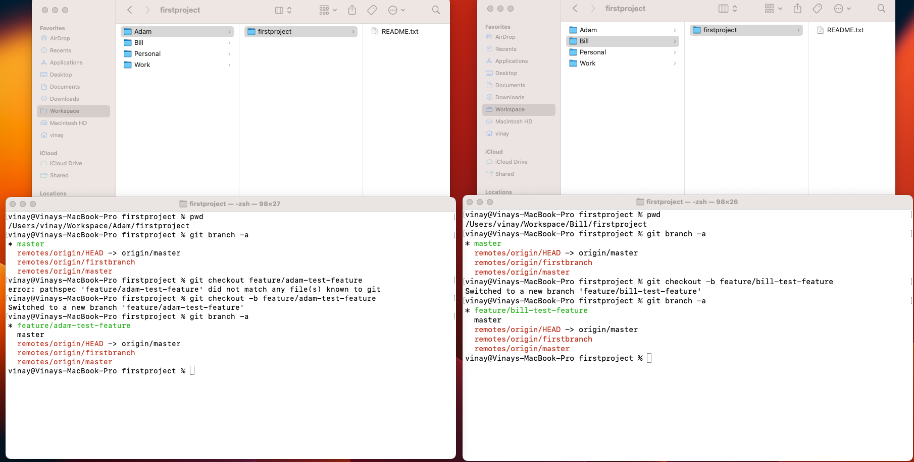
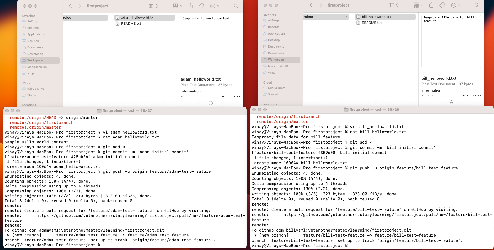
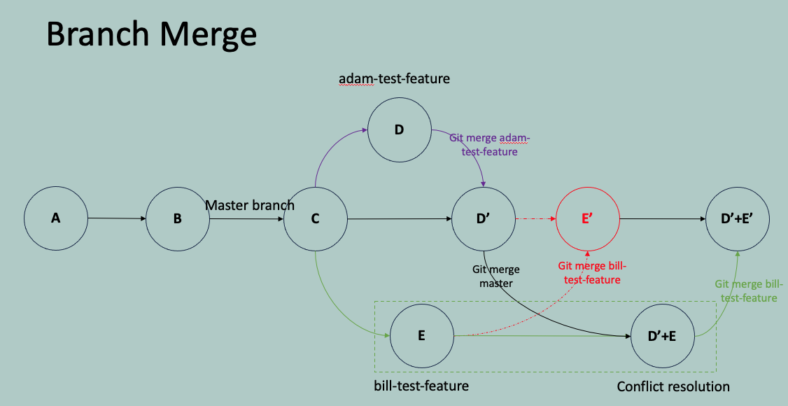

## Real world multiple users/Team example
- Real world multiple users Working on a single project
  - Create Pull request
- Merge conflict
  - How to resolve merge conflict
- Merging a branch to master
  - Fast forward vs no fast forward

## Real world multiple users Working on a single project
- Previously, we pushed our local repository changes to GitHub. 
- After successfully creating a startup project, you hired two developers to collaborate with. This chapter covers how to use Git when working in a team.
- When you join a team that has already started working on a repository, you need to first obtain a copy of the code from the central repository before you can start working on it.
- **Cloning** is creating a copy of remote/cloud repository. When working with a cloned repository, any changes made are independent of the original development.

## Real world multiple users Working on a single project
> *background:* to simulate the process, I created two separate GitHub accounts. Running two users on the same computer. Usually, individual users work on their computers. Configured local git configurations per individual folder. [Ref: Two configure multiple GitHub Accounnts on a single machine](../Miscellaneous/readme.md#management-of-multiple-git-user-accounts-on-a-single-machine)

**Case - 1:**
- Let's consider a scenario where two users are working on different features (two separate files) and then merge their changes without any conflict.
- Clone the repository

- Remote branches before the operations

- Create local branch for adding feature code changes

- Create code changes and Push the feature branch changes to remote repo

- Remote branches after the operations

- Individual user Create Pull request to merge changes to master/main branch, 

- It will go through code/peer review
> here, bill requested a merge request and admin(yetanothermasterylearning) can review and approve the request.


- final results - Bill feature changes are merged to master branch


**Case - 2:**
- Let's consider a scenario where two users are working on same file and then merge their changes go through the merge conflict process.
- Create local branch and do changes on common file

- Push changes to remote repo

- Remote repo with changes

- Let's merge adam's changes, as it's merging changes from adam-feature1 to master/main. It doesn't create merge conflict.

- Let's merge bill's changes, as it's merging changes from bill-feature1 to master/main and master branch already has changes at same file and same line number. It create merge conflict at pull request time


## Resolve Merge conflict
> Here, we want to merge our current branch with the master branch. The master branch is a go-to branch for all developers work to test or production environment, So we first merge the master branch to our branch; resolve the conflict, and push our branch to remote and create pull request.
- [Ref: Merging a branch](../05.%20Branch%20Concept/readme.md#merging-a-branch)
- Go to local reposity, checkout the master branch and pull the master to up date the branch with remote

-  then checkout your feature branch and then merge the master branch to your feature branch

- git pause the merge when encounter conflict(s). Open the conflict file and you can see the markers (<<<<<<<, =======, >>>>>>>) to identify the conflict content.
> First, select the master changes and update your changes in a cascading fashion to easily resolve file conflicts. fashion to easily resolve file conflicts.

- mark the file as resolved after resolving the conflicts manually

- Push the changes; then the Pull request update the status



## Merging a branch to master
- Fast-Forward: Offers a clean and straightforward history but is only possible if the branches have a linear history.
- Non-Fast-Forward: Preserves the individual history of both branches but creates a merge commit, which can make the history more complex.
- git merge command automatically determine whether to perform a fast-forward or non-fast-forward merge based on the branch histories. However, in some cases, you might specify merge options to control the behavior, such as ```--no-ff``` to force a non-fast-forward merge.


## assignment
### Assignment-1 ###
Assume yourself as a developer
- Follow the branch naming standard approach and Create a feature branch for adding user service
- Create a file name user_service.md or UserService.java (any program file)
- Add some lines of text/code
- Push your branch to the remote
- Create a pull request to merge your feature branch changes to the master/developer branch

### Assignment-2 ###
Assume yourself as a team leader
- Take a look at the pull request 
- Add review comments, if any
- Approve the pull request and check the final master/developer branch code