## Miscellaneous
- Inviting collaborators to a personal repository
- Management of multiple git user accounts on a single machine

## Inviting collaborators to a personal repository
> If you're working on a team, the admin will provide the organization Git repository access. It doesn't require a collaborator invite to each individual repository.
- You can invite others to collaborate your personal repository
- In this step, we will learn how to invite two members to out [firstproject](https://github.com/yetanothermasterylearning/firstproject)
- Login to your GitHub.com, navigate to the main page of your repository.
- click Settings
- In the "Access" section of the sidebar, click Collaborators.
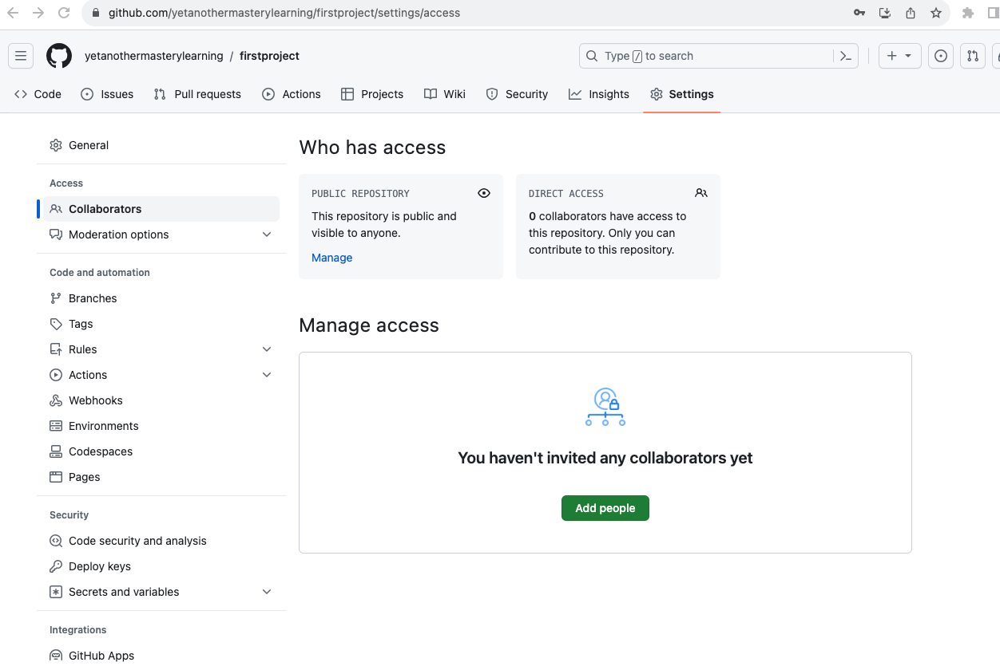
- Click Add people and search with user github account name or email
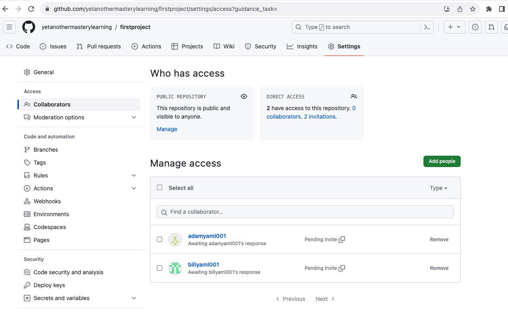
- The user will receive an email inviting them to the repository. Once they accept your invitation, they will have collaborator access to your repository.
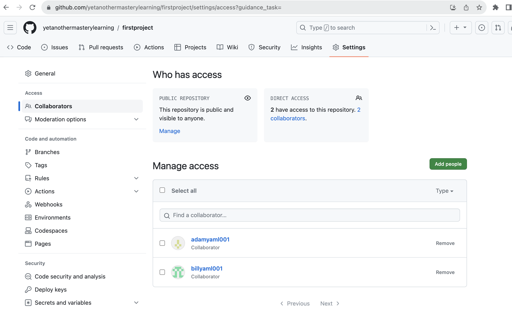

## Management of multiple git user accounts on a single machine
You have multiple GitHub accounts, one for personal work and the second one for hobby work. It can be a challenge to manage multiple accounts on the same computer. Lets assume these two accounts, [https://github.com/adamyaml001](https://github.com/adamyaml001) and [https://github.com/billyaml001](https://github.com/billyaml001).

- Generate SSH keys for each account
  - First, you need to generate SSH keys for each GitHub account. 
  - change your current directory to .ssh folder.
  - ```$ cd ~/.ssh```
  - use the following command pattern to generate an SSH key
  - ```ssh-keygen -t rsa -C "your-email-address" -f "id_rsa_github-username"```
    - 'C' represents the comment to help identify your ssh key
    - 'f' represents the name of the file where your SSH key is stored.
  - it creates both a public and a private key. These keys will have the same name, which you have specified after the -f option, but different extensions. The public key will have a .pub extension, while the private key will not have any extension at all.
  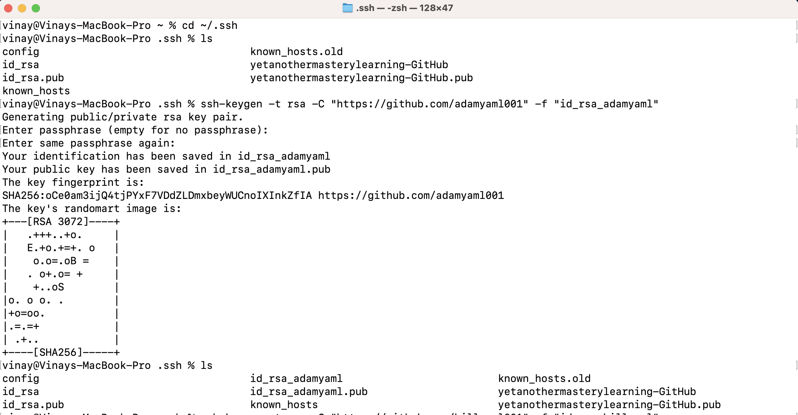
  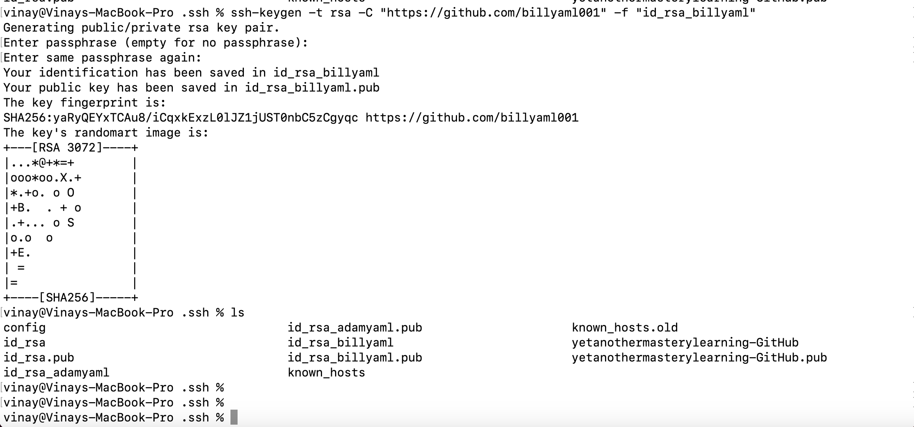

- Add SSH keys to local computer SSH agent
  - use following command to add the keys to the SSH Agent.
  - ```ssh-add -K ~/.ssh/<private_key>```
  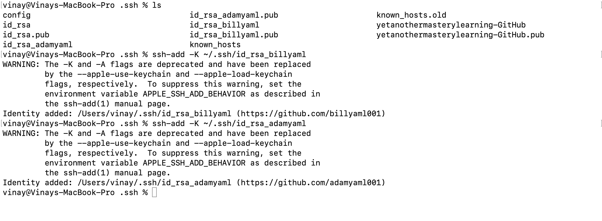

- Add SSH public keys to the GitHub account
  - To proceed, you need to add the SSH public key to GitHub account. Log in to the corresponding GitHub account and go to the "Settings" page. Click on the "SSH and GPG keys" tab, then click the "New SSH key" button. 
  - Copy the contents of the corresponding public key (pub extension) file (located in ~/.ssh/) and paste into the "Key" field. Click "Add SSH key" to save the key.
  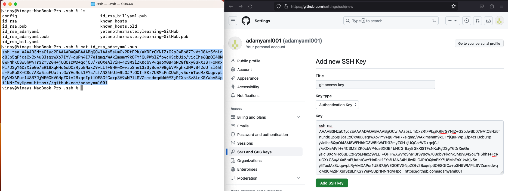
  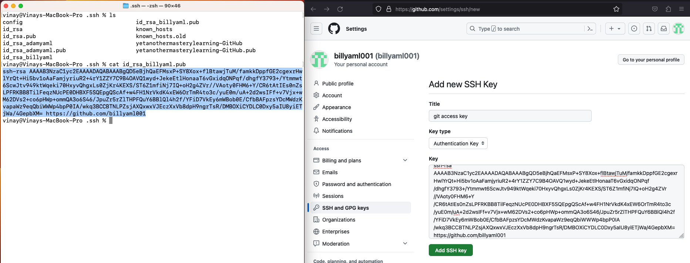
  - For each GitHub account you plan to use, repeat this process using the appropriate SSH key.

- Create a Config File
  - The ~/.ssh/config file allows us to specify the different hosts and SSH keys for each GitHub account.
  - If config file does not exist then create one and add following template corresponding to each account
  ```
  # Account 1
    Host github.com-account1
        HostName github.com
        User account1
        IdentityFile ~/.ssh/<ssh_privatekey_name>
  ```
  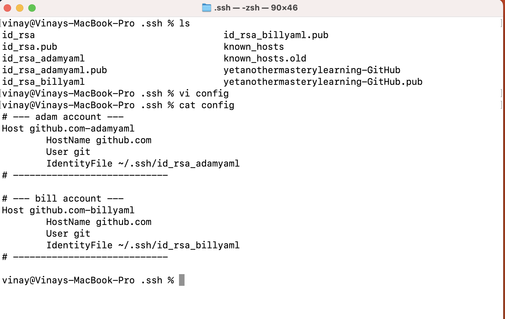

- Performing Git operations
  - To perform Git operations on your computer, you don't need to make any changes. However, if you want to perform operations like publishing or cloning, you need to provide Git and ssh-agent with the Git remote URL, host, username, and email. Doing this will enable you to easily manage your Git repositories and perform various operations without any issues.
  - Let's configure global and local git username and email and then do initial push and clone operations.
  - Configure the default git username and email using the git config command in the terminal at your user directory location. Use the local git config file for individual accounts.
  - I am using "yetanothermasterylearning" as default and individual user account under account name folder and keep the project under the corresponding folders(you can imagine adam and bill folder like personal and work folders)
  
  - usually git ssh url pattern follows like ```git@github.com:<account-username>/<repository-name>.git```
  - Replace the host name(here: github.com) with the hostname value from the ssh config.
  </br>
  for example:
  ```
  # Account 1
    Host github.com-adamyaml
        HostName github.com
        User adamyaml
        IdentityFile ~/.ssh/<ssh_privatekey_name>
  ```
  as the host value is github.com-adamyaml, The repo url is git@github.com-adamyaml:adamyaml001/firstproject.git
  - Let's perform pushing a initial commit changes from local system to github under adam account
  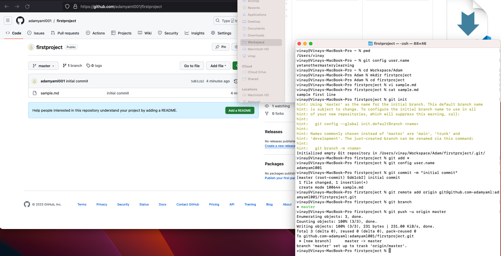
  - Let's perform clone the previous project from github to local system and push another commit
    clone operation:
  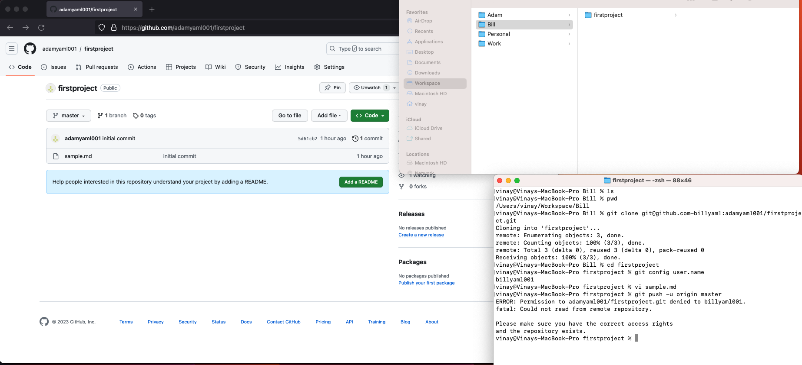
    Invitation for Collabration:
  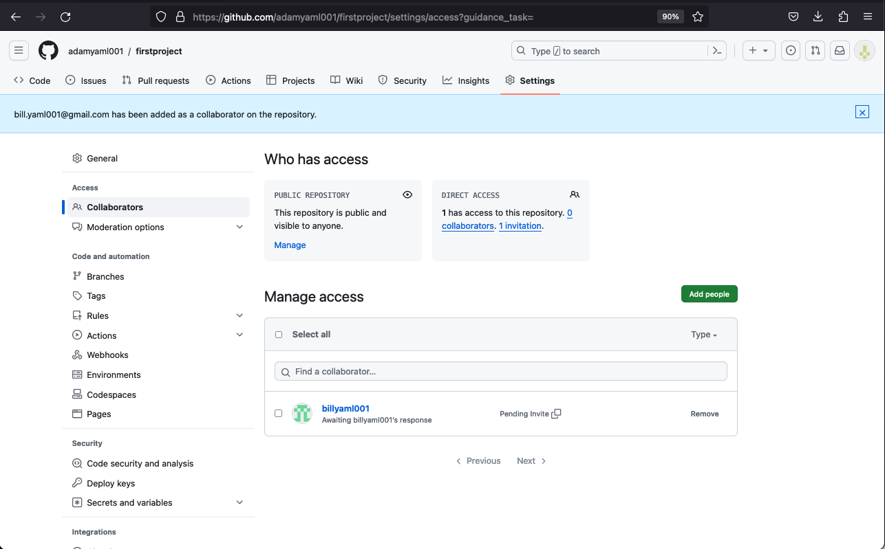
    Push the code:
  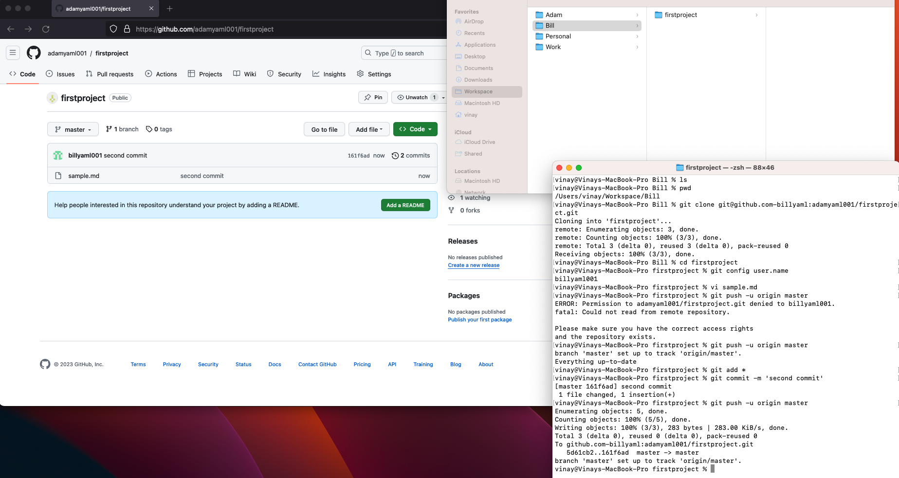
